# Deduplicate Images 

This script uses [ImageHash](https://github.com/jenssegers/imagehash) to generate a hash for each image in the folder defined.

Then it calculates hash-distance between images.

Thereshold is set looking at distances between images to find similar images.

Takes about **2.3 seconds to classify 12 images**.


# Requirements:

```
ImageHash==3.4
matplotlib==2.0.2
scipy==0.19.1
Pillow==5.0.0
```

# Similar Images:

## Set 1:

 
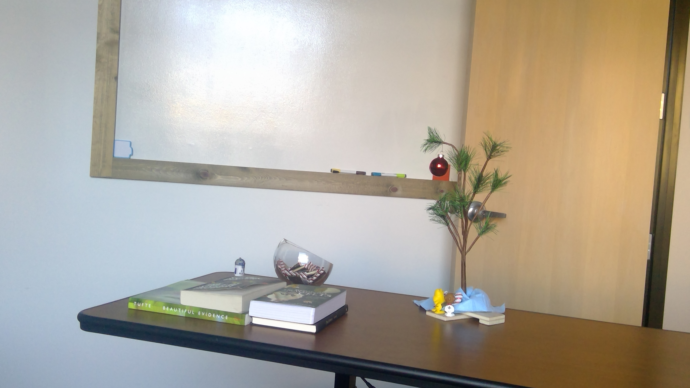
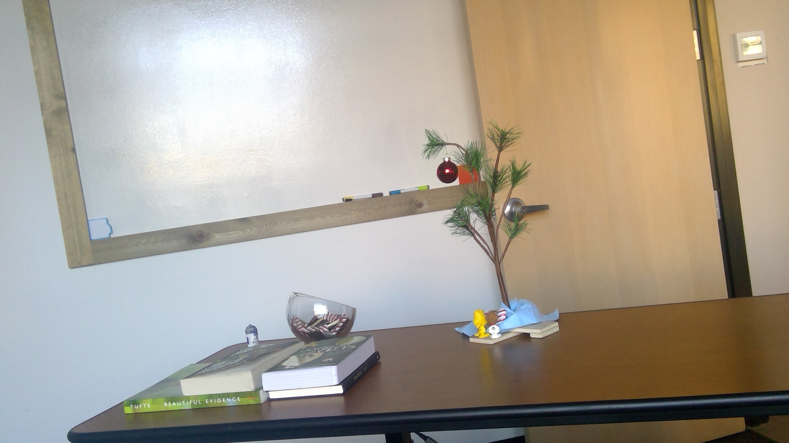 
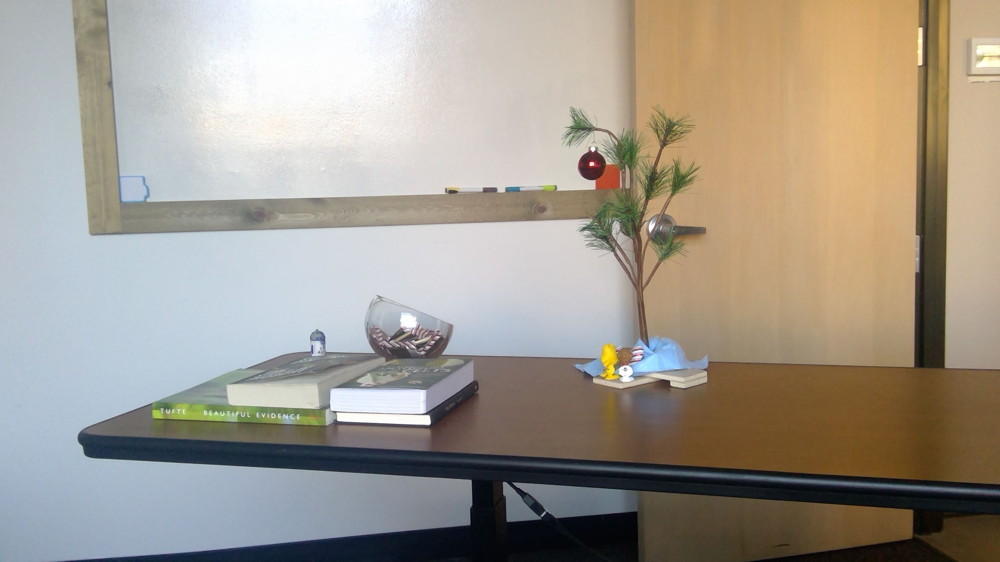

## Set 2:

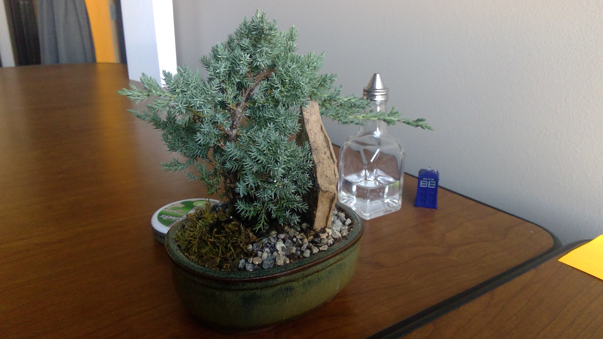 
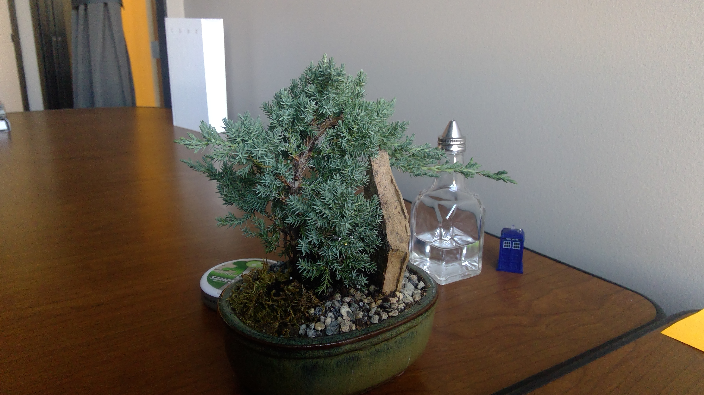
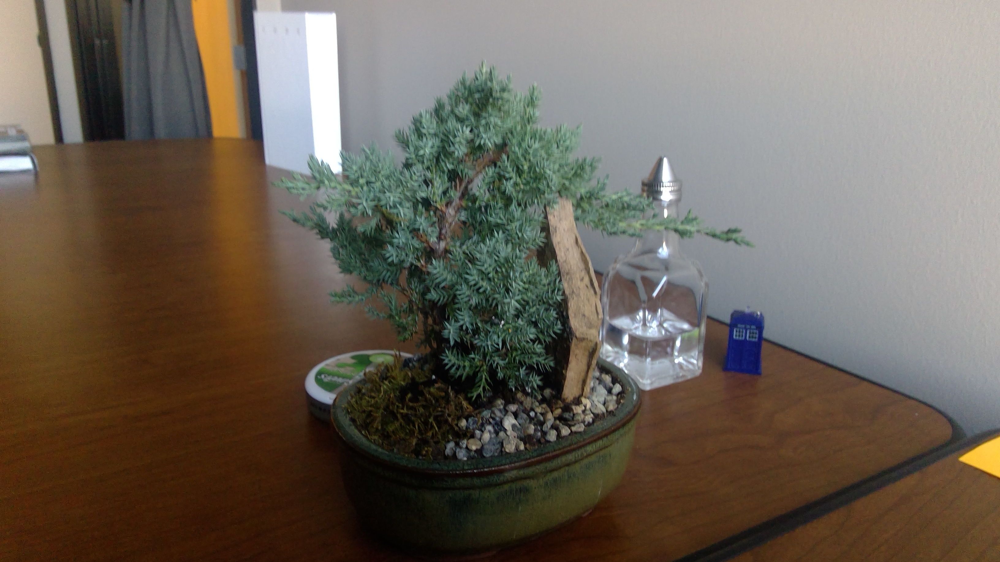 
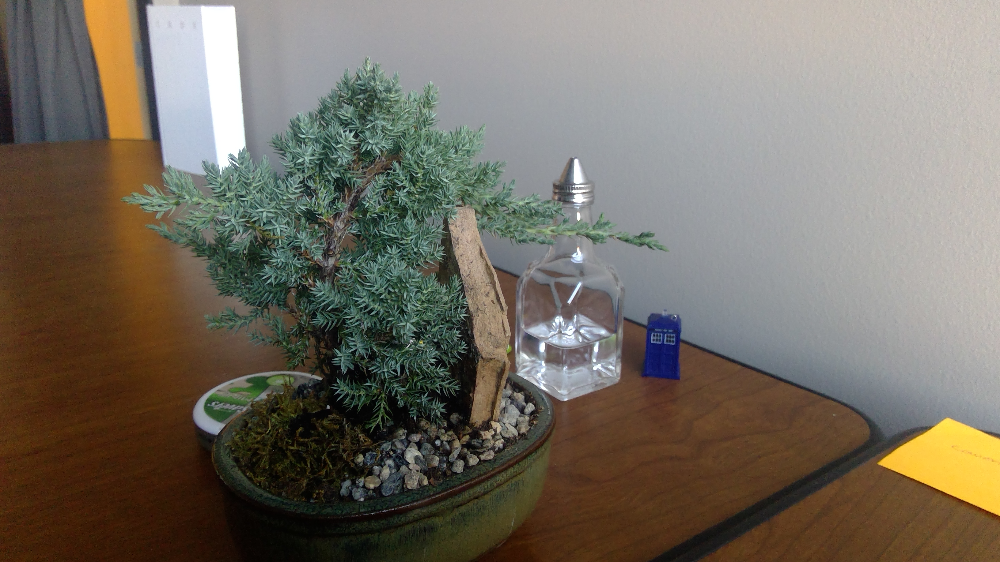
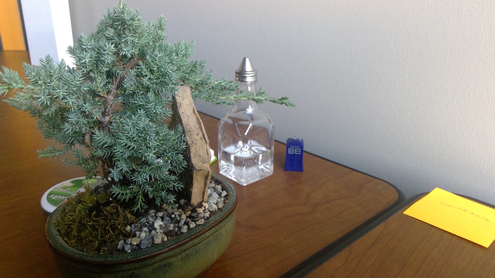

## Set 3:

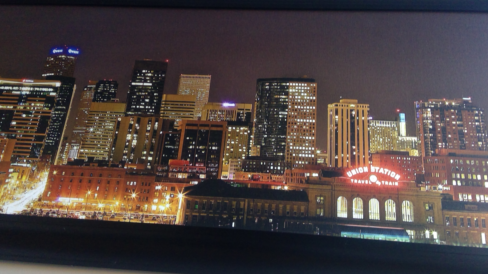 
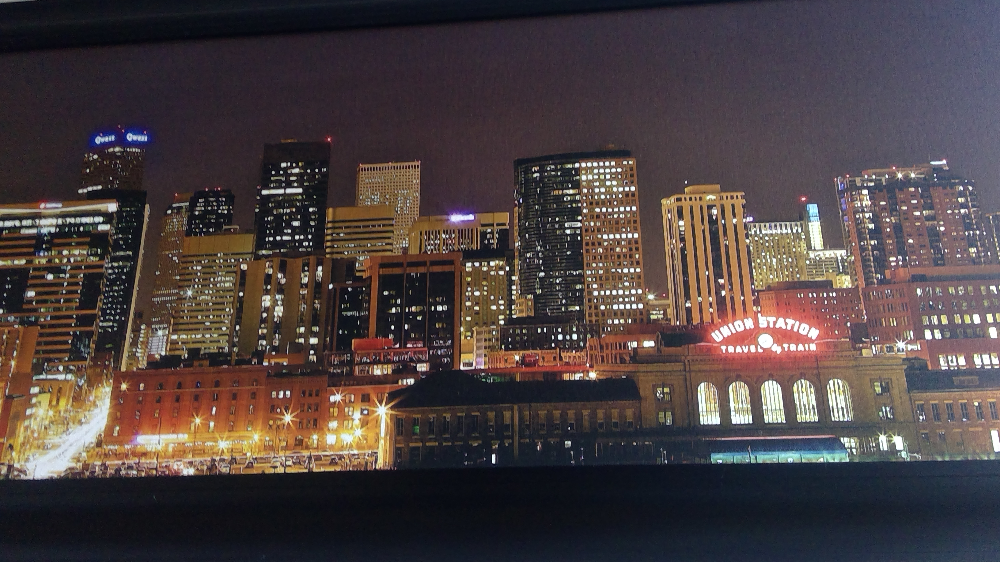
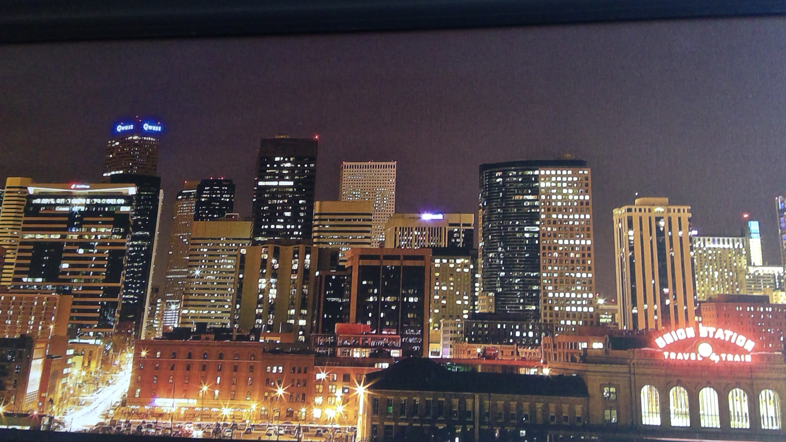 
